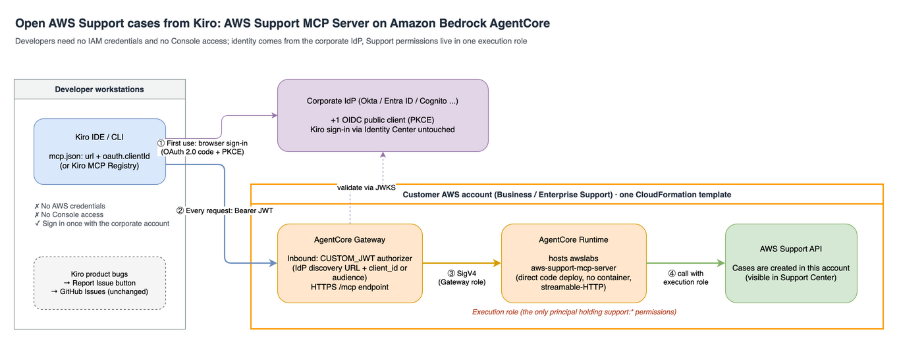

# AWS Support MCP Server on Amazon Bedrock AgentCore

Open, monitor, and reply to AWS Support cases directly from [Kiro](https://kiro.dev) — **without giving developers IAM credentials or AWS Management Console access**.

Enterprise Support entitlements are account-level, but creating a support case normally requires signing in to the Support Center or holding IAM credentials with `support:*` permissions. In organizations with hundreds of Kiro users, most developers have neither, so a Kiro or AWS service problem can sit for days until someone with Console access is found.

This sample hosts the open-source [AWS Support MCP Server](https://github.com/awslabs/mcp/tree/main/src/aws-support-mcp-server) (from `awslabs/mcp`) on **Amazon Bedrock AgentCore Runtime**, exposes it through an **AgentCore Gateway** that validates tokens issued by your corporate identity provider (Okta, Microsoft Entra ID, Amazon Cognito, ...), and keeps the Support API permissions in **one IAM execution role** that the platform team controls. Developers sign in once with their corporate account from inside Kiro and can then work with support cases as MCP tools.

Everything is deployed by a single CloudFormation template into your own AWS account.



## How it works

1. A developer's Kiro connects to the Gateway URL. On first use, Kiro opens the browser for an OAuth 2.0 authorization-code + PKCE sign-in against the corporate IdP (a public client — no client secret on developer machines).
2. Every MCP request carries the resulting bearer JWT. The AgentCore Gateway validates it (`CUSTOM_JWT` authorizer: IdP discovery URL plus allowed client ID or audience) and forwards the call to the Runtime using its own IAM role (SigV4).
3. The AgentCore Runtime hosts the unmodified `awslabs.aws-support-mcp-server` (v0.1.23) behind a ~30-line streamable-HTTP entrypoint ([`app/main.py`](app/main.py)).
4. The Runtime **execution role** is the only principal in the account with Support API permissions. Cases are created in this account and are visible in the Support Center like any other case.

Two things this sample does **not** change:

- Kiro sign-in itself (IAM Identity Center / your IdP) is untouched. You register one *additional* OIDC application in the same IdP for the support tools.
- Kiro product bugs still go through Kiro's built-in **Report Issue** → GitHub Issues channel. This sample is for cases that need your AWS Support plan.

## Repository layout

| Path | What it is |
|---|---|
| [`cfn/support-mcp-agentcore.yaml`](cfn/support-mcp-agentcore.yaml) | CloudFormation template: AgentCore Runtime + Gateway + Gateway target + 2 IAM roles (optional Cognito user pool for evaluation) |
| [`app/main.py`](app/main.py) | Runtime entrypoint: serves the upstream FastMCP server over stateless streamable-HTTP on port 8000 |
| [`app/awslabs/`](app/awslabs/) | `awslabs.aws-support-mcp-server` v0.1.23, vendored unmodified (Apache-2.0, see [THIRD-PARTY-LICENSES](THIRD-PARTY-LICENSES)) |
| [`build.sh`](build.sh) / [`deploy.sh`](deploy.sh) | Build the Linux arm64 code package with `uv`; upload to S3 and create/update the stack |
| [`kiro/mcp.json.example`](kiro/mcp.json.example) | Kiro MCP configuration snippet developers paste (or publish via Kiro MCP Registry) |
| [`kiro/steering-aws-support.md`](kiro/steering-aws-support.md) | Optional Kiro steering file that standardizes how cases are filed (service code lookup, severity, Request ID, reporter on CC) |

---

## Part 1 — For IT / platform teams: deploying the service

### Prerequisites

| # | Who | What you need |
|---|---|---|
| 1 | AWS account owner | An account covered by a **Business, Enterprise On-Ramp, or Enterprise Support plan** (the Support API returns `SubscriptionRequiredException` otherwise). Cases will be created in this account. |
| 2 | AWS account owner | A region where Amazon Bedrock AgentCore is available. The template was tested in `us-east-1`. The Support API endpoint lives in `us-east-1` regardless of where the Runtime is deployed — the template pins that for you. |
| 3 | Deployer | Permissions to create IAM roles, AgentCore resources and an S3 bucket; [`uv`](https://docs.astral.sh/uv/) and the AWS CLI installed locally. Docker is **not** required. |
| 4 | IdP administrator | One OIDC **public** client for Kiro (details below). You receive back a **client ID**, the IdP's **discovery URL**, and — for Okta — the **audience**. |

### Step 1 — Register an OIDC application in your IdP

Create a *native / public* OIDC application with:

- Grant types: **Authorization Code** and **Refresh Token**; PKCE enabled; **no client secret**.
- Sign-in redirect URI: `http://localhost:<port>/oauth/callback` (also add `http://127.0.0.1:<port>/oauth/callback`). Pick one port for the whole company and pass it as `KiroCallbackPort`; the default is `8080`.
- Scopes: `openid`, `email`, `profile`, `offline_access` (refresh tokens).
- Assign the application to the users or groups who should be able to file cases. Assignment is your first access-control layer.

Provider notes:

| IdP | Template parameters |
|---|---|
| **Okta** | `OidcDiscoveryUrl` = `https://<org>.okta.com/oauth2/default/.well-known/openid-configuration` (or your custom authorization server); `OidcClientId` = the app's client ID; **`OidcAudience` = `api://default`** (or your custom server's audience). Okta access tokens carry the client ID in a `cid` claim rather than `client_id`, so the Gateway must validate the audience instead. |
| **Microsoft Entra ID** | Expose an API on the app registration so the access token's `aud` is your application, then set `OidcClientId` (or `OidcAudience`) accordingly. |
| **Amazon Cognito / Auth0** | `OidcDiscoveryUrl` + `OidcClientId`. |

### Step 2 — Build the code package

```bash
./build.sh          # -> dist/support-mcp-agentcore.zip (Linux arm64, Python 3.12)
```

The package contains `main.py`, the vendored `awslabs/` server and its dependencies. AgentCore Runtime runs it directly from S3 — no container image, no ECR.

### Step 3 — Deploy the stack

Using the helper script (creates a private, versioned S3 bucket if needed):

```bash
AWS_PROFILE=<profile> AWS_REGION=us-east-1 \
IDP_MODE=ExternalOIDC \
OIDC_DISCOVERY_URL='https://<tenant>/.well-known/openid-configuration' \
OIDC_CLIENT_ID='<client_id>' \
OIDC_AUDIENCE='api://default' \
KIRO_CALLBACK_PORT=8080 \
./deploy.sh
```

Or upload `dist/support-mcp-agentcore.zip` to a bucket of your own and create the stack from `cfn/support-mcp-agentcore.yaml` in the console or CLI:

```bash
aws cloudformation create-stack --stack-name support-mcp-agentcore --region us-east-1 \
  --template-body file://cfn/support-mcp-agentcore.yaml --capabilities CAPABILITY_NAMED_IAM \
  --parameters \
    ParameterKey=CodeS3Bucket,ParameterValue=<your-bucket> \
    ParameterKey=IdentityProviderMode,ParameterValue=ExternalOIDC \
    ParameterKey=OidcDiscoveryUrl,ParameterValue='https://<tenant>/.well-known/openid-configuration' \
    ParameterKey=OidcClientId,ParameterValue=<client_id> \
    ParameterKey=OidcAudience,ParameterValue=api://default \
    ParameterKey=KiroCallbackPort,ParameterValue=8080
```

`OidcAudience` is required for Okta and can be omitted for IdPs whose access token carries a `client_id` claim. Stack creation takes about two minutes.

> AgentCore Runtime and Gateway names must be unique per account and region. To deploy a second copy (for example a test stack next to production), set the `RuntimeName` and `GatewayName` parameters (`RUNTIME_NAME` / `GATEWAY_NAME` in `deploy.sh`); otherwise stack creation fails with `AlreadyExists`.

**What the template creates**

| Resource | Purpose |
|---|---|
| `AWS::IAM::Role` *runtime-exec* | Assumed by AgentCore Runtime. The **only** principal with Support permissions: `support:CreateCase`, `DescribeCases`, `DescribeCommunications`, `AddCommunicationToCase`, `ResolveCase`, `AddAttachmentsToSet`, `DescribeAttachment`, plus the read-only catalog calls (`DescribeServices`, `DescribeSeverityLevels`, `DescribeCreateCaseOptions`, `DescribeSupportedLanguages`). Also `s3:GetObject` on the code package and CloudWatch Logs / X-Ray / metrics baseline. Trust policy is scoped to `bedrock-agentcore.amazonaws.com` from this account. |
| `AWS::IAM::Role` *gateway* | Assumed by AgentCore Gateway; allows only `bedrock-agentcore:InvokeAgentRuntime` on this Runtime. |
| `AWS::BedrockAgentCore::Runtime` | Hosts the MCP server (protocol `MCP`, public network mode, Python 3.12 code artifact from S3). |
| `AWS::BedrockAgentCore::Gateway` | MCP gateway with `CUSTOM_JWT` inbound authorizer bound to your IdP. |
| `AWS::BedrockAgentCore::GatewayTarget` | Points the Gateway at the Runtime's MCP endpoint using the Gateway role (SigV4). |
| *(DemoCognito mode only)* Cognito user pool, domain, app client | Self-contained IdP for evaluation. |

No public S3 buckets, no public resource policies, no cross-account trust. Trim the Support permissions further if you like (for example remove `ResolveCase` or the attachment actions); the tool set exposed to Kiro follows whatever the role allows.

### Step 4 — Distribute the Kiro configuration

The stack output `KiroMcpJson` is a ready-to-paste snippet:

```json
{"mcpServers":{"aws-support":{
  "url":"https://<gateway-id>.gateway.bedrock-agentcore.us-east-1.amazonaws.com/mcp",
  "oauth":{"clientId":"<client_id>","redirectUri":"localhost:8080","oauthScopes":["openid","email","profile","offline_access"]}
}}}
```

Distribution options:

- **Pilot**: hand the snippet to the developers who need it; they add it to `~/.kiro/settings/mcp.json`. See [`kiro/mcp.json.example`](kiro/mcp.json.example) for a version that also auto-approves the read-only tools.
- **Scale**: publish the server through **Kiro MCP Registry** (Kiro Pro tier with IAM Identity Center) so users pick it from a list instead of editing files. Note that once a registry is active, only registry-listed servers can run — align with your Kiro administrator first.
- Optionally ship [`kiro/steering-aws-support.md`](kiro/steering-aws-support.md) as team steering. It tells the assistant to look up valid service/category codes, choose severity conservatively, include the Kiro Request ID, and **put the reporter's email on CC** so Support replies reach the developer directly.

### Evaluation without a corporate IdP

Set `IDP_MODE=DemoCognito DEMO_USER_EMAIL=you@example.com` (or `IdentityProviderMode=DemoCognito`). The template creates a Cognito user pool with a hosted UI and one user (temporary password by email). Everything else is identical, which makes this a convenient way to validate the pipeline before involving the IdP team.

### Operations

- **Logs**: Runtime logs are in CloudWatch under `/aws/bedrock-agentcore/runtimes/<runtime-id>-*`. In Kiro use *Show MCP Logs*.
- **Triage**: a `401` from the Gateway means token or IdP configuration; `421`/`5xx` means the Runtime.
- **Upgrade**: replace the zip in S3 (or change `CodeS3Key`) and update the stack; the Runtime rolls to the new version.
- **Cost**: AgentCore Runtime bills for active processing time and Gateway per call; there is no always-on charge. See the AgentCore pricing page.
- **Uninstall**: delete the stack. The S3 bucket you created is yours to remove; note that `deploy.sh` enables versioning on the bucket it creates, so empty all object versions and delete markers (`aws s3api list-object-versions` + `delete-objects`) before `delete-bucket`.

---

## Part 2 — For developers: using it from Kiro

You need: Kiro, your corporate account, and the `aws-support` entry in your Kiro MCP configuration (provided by IT or selected from the Kiro MCP Registry). You do **not** need AWS credentials, an IAM user, or Console access.

### One-time: sign in

1. Add the snippet from IT to `~/.kiro/settings/mcp.json` (or select the server in the registry).
2. Open Kiro's **MCP Servers** panel, find `aws-support`, and click **Authenticate**. A browser window opens with your company's sign-in page.
3. After signing in you are redirected back to Kiro. The server shows as connected and lists 11 `aws-support___*` tools. The token is stored in Kiro's secret storage and refreshed automatically.

> Kiro does **not** open the browser on its own at startup for OAuth-protected servers — until you click **Authenticate** the server appears unauthenticated or disconnected. This is a one-time step.

### Submit a case

Describe the problem in the Kiro chat, for example:

> Open an AWS Support case: since this morning Kiro returns "model 'auto' not available" for everyone on my team. Request ID abc-123. Severity: system impaired. Put my email me@example.com on CC.

The assistant will:

1. Call `aws-support___describe_services` (and severity levels) to pick a valid service/category/severity code.
2. Call `aws-support___create_support_case` with the subject, a body that includes your name, email, environment details and Request ID, and your email in `cc_email_addresses`.
3. Read back the **case ID** and the Support Center link.

Write tools (`create_support_case`, `add_communication_to_case`, `resolve_support_case`) ask for your confirmation before running unless you auto-approve them; the read-only tools can be auto-approved (see the example config).

### Monitor a case

- Ask Kiro: *"List my open AWS Support cases"* → `aws-support___describe_support_cases` (filter by status, time range, or case ID).
- Ask: *"Show the latest reply on case 1234567890"* → `aws-support___describe_communications` returns the correspondence thread.
- **Email**: AWS Support copies every correspondence to the addresses on the case's CC list (`ccEmailAddresses`, up to 10). If your email was added at creation time, you receive each Support reply in your inbox without opening Kiro. The AWS account's contact email also receives case notifications — that is standard Support behavior and is why a shared mailbox is recommended for the account email.

### Reply to or close a case

- *"Reply on case 1234567890: here are the logs you asked for ..."* → `aws-support___add_communication_to_case` (you can add CC addresses again here).
- *"Resolve case 1234567890"* → `aws-support___resolve_support_case` (the steering file asks the assistant to confirm first).

### What to expect

- Cases created through the API use the **web** contact method. If you need a phone or chat session, ask Support in the case or use the Support Center.
- The case's *Submitted by* field shows the shared execution role, not your name. Your identity is carried in the case body and the CC list, which is what Support engineers use to communicate with you.
- Kiro product bugs (crashes, UI issues) should still go through Kiro's **Report Issue** button, which files a GitHub issue with the Request ID for the Kiro team.

### Known client-side pitfalls

| Symptom | Cause | Fix |
|---|---|---|
| Browser opens, but the redirect fails or times out after ~60 s | `oauth.redirectUri` in `mcp.json` was written as a full URL. Kiro IDE expects **`host:port`** (e.g. `localhost:8080`) and falls back to a random port otherwise, which no longer matches the IdP registration. | Use `"redirectUri": "localhost:<port>"`. The IdP keeps the full `http://localhost:<port>/oauth/callback`. |
| Server shows *disconnected* right after Kiro starts and nothing happens | Kiro starts OAuth servers passively and only opens the browser when you trigger authentication. | Click **Authenticate** in the MCP Servers panel once. |
| After clicking Authenticate the browser lands on an IdP error page (e.g. `BadRequest`), and Kiro's log shows *Opening authorization URL* a minute late | Kiro's discovery requests to the IdP went out over IPv6 and hung. Some VPN clients install an unreachable IPv6 default route; most IdPs publish AAAA records. | Check with `curl -6 -m 5 https://<idp-host>/`. If it hangs, disconnect the VPN or have IT fix the IPv6 route policy. |

---

## Security considerations

- **Authentication boundary**: the Gateway validates JWTs against your IdP's JWKS before any request reaches the Runtime; the Runtime accepts only SigV4 calls from the Gateway role. `main.py` disables FastMCP's Host-header (DNS rebinding) guard because AgentCore forwards requests with a non-localhost `Host` header and the Gateway/Runtime are the trust boundary — do not run the entrypoint exposed on a network outside AgentCore.
- **Authorization**: access = IdP application assignment. For finer control, add a claim rule (`CustomClaims`) to the Gateway authorizer, for example requiring a `groups` claim to contain a specific group.
- **Least privilege**: Support permissions exist only on the Runtime execution role, with the explicit action list above. Developers hold no AWS credentials.
- **Data handling**: case content flows through AgentCore to the AWS Support API; AWS Support automatically redacts secret keys and credit card numbers in case text, but do not paste secrets into cases.
- **Attribution**: all cases are created by the same execution role. Reporter identity is added to the body and CC by the assistant (steering). See *Possible extensions* for a server-side approach.

## Possible extensions

- **Automatic reporter identity**: switch the Gateway target to `JWT_PASSTHROUGH`, enable a `CUSTOM_JWT` authorizer on the Runtime, and have `main.py` read the caller's `email` claim and inject it into `create_support_case` / `add_communication_to_case` — so the CC no longer depends on the assistant. Your IdP must include an email (or equivalent) claim in the access token.
- **Group-based access** via the Gateway authorizer's `CustomClaims`.
- **Case dashboards** for IT: AWS Support emits `Support Case Update` events to Amazon EventBridge; route them to a chat channel or a table for an account-wide view.

## Disclaimer

This repository contains **sample code for demonstration purposes and is not production-ready as-is**. It shows how to host an MCP server on Amazon Bedrock AgentCore and integrate it with Kiro. Before any production use, review and adapt it to your organization's security, identity, compliance and operational requirements (for example IdP hardening, access restrictions via claims, logging and monitoring, and change management for the execution role's permissions).

## Security issue notifications

See [CONTRIBUTING](CONTRIBUTING.md#security-issue-notifications) for information on reporting security issues.

## License

This library is licensed under the MIT-0 License. See the [LICENSE](LICENSE) file. The vendored AWS Support MCP Server is licensed under the Apache License 2.0 — see [THIRD-PARTY-LICENSES](THIRD-PARTY-LICENSES).
